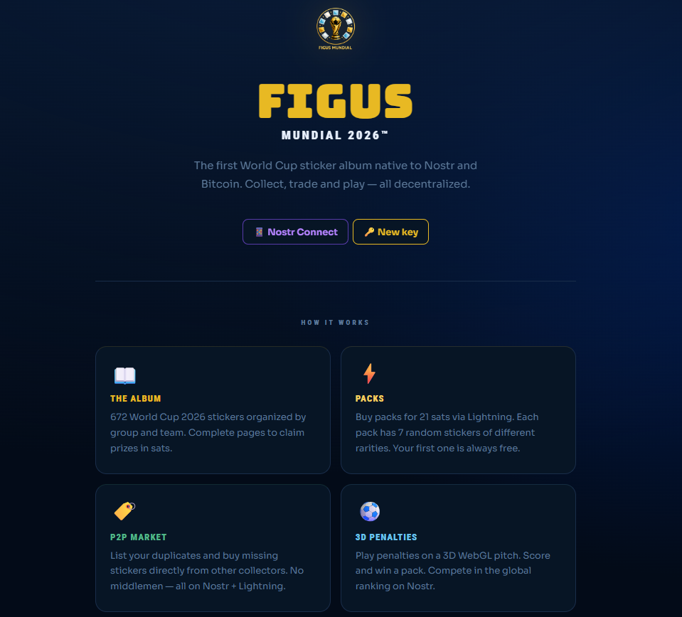

# Figus — Álbum del Mundial 2026 en Nostr

Álbum de figuritas del FIFA World Cup 2026™ construido sobre Nostr + Lightning. Sin base de datos — todo el estado vive en los relays. Desplegado en [figusmundial-rho.vercel.app](https://figusmundial-rho.vercel.app).



## Características

- **Sobres** — comprá paquetes de 7 figuritas al azar por 21 sats vía Lightning (NIP-57). El primer sobre es gratis.
- **Colección** — visualizá tu álbum con animaciones foil/shiny, filtrá por equipo y rareza.
- **Mercado P2P** — listá y comprá figuritas repetidas directamente entre usuarios, liquidado por zap.
- **Fixture** — calendario completo del Mundial 2026: fase de grupos (MD1–MD3) y eliminatorias (Ronda de 32 → Gran Final) con horarios en UTC y hora Argentina.
- **Pronósticos** — predecí resultados de cada partido; los pronós se publican como eventos Nostr (kind 30302) y se actualizan automáticamente.
- **Penales** — minijuego de penales. Ganás un sobre gratis. También podés desafiar a otros usuarios a tandas de penales y robarles figuritas.
- **Compartir en Nostr** — publicá tus figuritas brillantes como notas kind:1 con la imagen del card adjunta (subida a nostr.build).
- **Multi-idioma** — español e inglés.
- **Multi-firmante** — NIP-07 (extensión), NIP-46 (Nostr Connect / bunker), clave local (nsec) o generación de clave nueva.

## Requisitos

- Node.js 18+
- Una Lightning Address para el issuer (Alby, Wallet of Satoshi, etc.)
- Opcionalmente: una wallet NWC para pagos automáticos de recompensas

## Puesta en marcha

```bash
npm install
cp .env.example .env.local
```

### 1. Generar las claves del issuer

```bash
npm run seed
```

La primera vez (sin `ISSUER_NSEC` en `.env.local`) imprime un par de claves nuevo. Copialo:

```
NEXT_PUBLIC_ISSUER_PUBKEY=<hex>
ISSUER_NSEC=nsec1...
```

### 2. Publicar el catálogo

Con las claves ya cargadas, corré el seed de nuevo — esta vez publica el álbum, las figuritas y las definiciones de sobres en los relays:

```bash
npm run seed
```

### 3. Levantar el issuer

Escucha zap receipts (NIP-57) y emite grants de ownership, settlements de trades y pagos de recompensas vía NWC:

```bash
npm run issuer
```

### 4. Levantar el cliente

```bash
npm run dev
# http://localhost:3000
```

## Variables de entorno

| Variable | Descripción | Requerida |
|---|---|---|
| `NEXT_PUBLIC_ALBUM_ID` | Slug único del álbum en Nostr (d tag) | Sí |
| `NEXT_PUBLIC_ISSUER_PUBKEY` | Pubkey hex del issuer | Sí |
| `ISSUER_NSEC` | Clave privada del issuer (solo servidor) | Sí |
| `NEXT_PUBLIC_ISSUER_LN_ADDRESS` | Lightning address del issuer | Sí |
| `REWARD_NWC` | Nostr Wallet Connect del issuer para pagar recompensas | No |
| `REWARD_PAGE_SATS` | Sats por completar una página de equipo | No |
| `REWARD_ALBUM_SATS` | Sats por completar el álbum entero | No |
| `NEXT_PUBLIC_RELAYS` | Lista de relays separada por comas | No |
| `NEXT_PUBLIC_SITE_URL` | URL pública del deploy (para links en notas compartidas) | No |

## Estructura

```
src/
  app/
    page.tsx            # orquesta identidad, estado de juego y navegación por tabs
    layout.tsx          # layout raíz, fuentes
    globals.css         # tokens CSS, animaciones (foil, flip, shine)
  components/
    Album.tsx           # grilla del álbum con zoom de sticker
    Packs.tsx           # apertura de sobres + reveal animado
    Market.tsx          # mercado P2P (listings, compra, mis ventas)
    Fixture.tsx         # fixture completo: fase de grupos + eliminatorias + pronósticos
    PenaltyGame.tsx     # minijuego de penales (client-side)
    PenaltyMatch.tsx    # desafíos P2P de penales entre usuarios
    PenaltyScene3D.tsx  # escena 3D con Three.js / React Three Fiber
    StickerCard.tsx     # card de figurita (foil, shiny, gradient)
    Connect.tsx         # login (NIP-07, NIP-46 QR, bunker, clave local)
    ShareButton.tsx     # captura el card + sube a nostr.build + publica nota
    Leaderboard.tsx     # tabla de posiciones
    Traders.tsx         # historial de trades
    MyStickers.tsx      # mis figuritas con opción de venta
    InvoiceModal.tsx    # modal de pago Lightning
    SettingsModal.tsx   # configuración de usuario
    NostrAvatar.tsx     # avatar desde perfil Nostr
    Flag.tsx            # bandera de país
  hooks/
    useIdentity.ts      # gestión de sesión (NIP-07 / NIP-46 / local)
    useGameState.ts     # estado completo del juego desde relays
    usePenaltyMatch.ts  # lobby + partidas de penales P2P
    usePronosticos.ts   # pronósticos de partidos (kind 30302)
    useLeaderboard.ts   # ranking de jugadores
    useProfile.ts       # perfil Nostr de un pubkey
    useTraders.ts       # historial de intercambios
  lib/
    constants.ts        # kinds de eventos, relays, ALBUM_ID
    catalog.ts          # catálogo de 1000 figuritas, rarezas, sorteo
    identity.ts         # firmado (NIP-07 / NIP-46 / local) + sesión
    share.ts            # captura DOM con html2canvas, upload a nostr.build
    zap.ts              # flujo NIP-57 (zap request → invoice → receipt)
    nwc.ts              # Nostr Wallet Connect (pagos automáticos)
    penalty.ts          # lógica de partidas de penales P2P
    pool.ts             # capa de relays (nostr-tools SimplePool)
    parsers.ts          # eventos Nostr → tipos del dominio
    i18n.ts             # strings en español e inglés
    types.ts            # tipos del dominio
issuer/
  index.ts              # listener de zap receipts — emite grants y settlements
  seed.ts               # genera claves + publica catálogo en relays
  lib.ts                # helpers del issuer
docs/
  figus-modelo-datos-nostr.md  # esquemas de todos los eventos Nostr
```

## Eventos Nostr usados

| Kind | Nombre | Descripción |
|---|---|---|
| 1 | Note | Posts compartidos (figuritas, ganancias en penales) |
| 1575 | Claim | El cliente solicita un sobre o recompensa al issuer |
| 1580 | Steal Claim | Reclamo de figurita ganada en penales |
| 9734 | Zap Request | Solicitud de pago para compra de sobre |
| 9735 | Zap Receipt | Confirmación de pago — dispara grants |
| 30100 | Ownership | Figurita en posesión de un usuario (emitido por issuer) |
| 30200 | Listing | Figurita listada en el mercado P2P |
| 30201 | Settlement | Liquidación de un trade (emitido por issuer) |
| 30300 | Penalty Match | Estado de una partida de penales P2P |
| 30302 | Pronóstico | Predicción de resultado de un partido (por usuario) |

## Login

Cuatro métodos soportados:

- **NIP-07** — extensión de navegador (Alby, nos2x, etc.). Solo aparece si la extensión está instalada.
- **Nostr Connect QR** — escaneá con Amber, nsec.app u otro firmante NIP-46.
- **Nostr Connect bunker** — pegá una URL `bunker://` o NIP-05 de firmante remoto.
- **Clave local** — generá o importá un nsec. Se guarda en localStorage. Útil para pruebas rápidas.

> **Usuarios de LibreWolf / Tor Browser:** `privacy.resistFingerprinting` bloquea el canvas API, lo que impide generar el QR. En ese caso usá bunker URL o clave local.

## Arquitectura

- **Sin base de datos** — todo el estado del juego se deriva de eventos Nostr en relays públicos.
- **Issuer trustless** — solo actúa ante un zap receipt `9735` válido firmado por la wallet del usuario. Nunca custodia fondos.
- **Imágenes de figuritas** — subidas a [nostr.build](https://nostr.build) en el momento de compartir (gratis, sin auth). Se adjuntan al note con tag NIP-92 `imeta`.
- **Pronósticos descentralizados** — cada usuario publica sus predicciones como eventos kind 30302 reemplazables. Sin servidor.
- **Persistencia de tab** — la URL usa el hash (`#fixture`, `#album`, etc.) para recordar la sección activa al refrescar.
